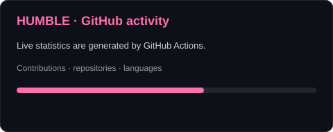
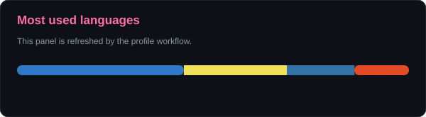

<!-- HUMBLE animated terminal banner — generated from the original portrait photo. -->
<picture>
  <source media="(prefers-color-scheme: dark)" srcset="assets/banner-dark.v9.svg">
  <source media="(prefers-color-scheme: light)" srcset="assets/banner-light.v9.svg">
  
</picture>

 

 

&nbsp;&nbsp;
&nbsp;&nbsp;
&nbsp;&nbsp;

 

---

## This is me :)

Hi, I'm **Mahesh Madhav**, the person behind **HUMBLE**. I'm a video editor and developer who likes mixing motion design, creative tools and web development.

- 🎬 I work with **After Effects, Premiere Pro and Photoshop**.
- 💻 I build with **HTML, CSS, JavaScript, React, Python and MySQL**.
- 🛠️ I build tools for editors, including **HUMBLE Studio** and **HUMBLE AE Downgrader**.
- 🎓 Diploma in Computer Engineering; currently studying **Data Analytics**.
- 🚀 I like turning small ideas into things people can actually use.
- 🌐 Portfolio: **[humblepf.vercel.app](https://humblepf.vercel.app/)**

 

## my perfect stack`

---

## signals

<table>
<tr>
<td width="50%" align="center" valign="middle">

<picture>
  <source media="(prefers-color-scheme: dark)" srcset="assets/radar-dark.svg">
  <source media="(prefers-color-scheme: light)" srcset="assets/radar-light.svg">
  
</picture>

</td>
<td width="50%" align="center" valign="middle">

<picture>
  <source media="(prefers-color-scheme: dark)" srcset="assets/radar-langs-dark.svg">
  <source media="(prefers-color-scheme: light)" srcset="assets/radar-langs-light.svg">
  
</picture>

</td>
</tr>
</table>

---

## Numbers matter? ohhh yes.

<picture>
  <source media="(prefers-color-scheme: dark)" srcset="assets/card-stats-dark.svg">
  <source media="(prefers-color-scheme: light)" srcset="assets/card-stats-light.svg">
  
</picture>

 

---

` Build with love · HUMBLE `

